# Disaster and Recovery Management App

Disaster and Recovery Management is a Windows desktop and API solution for SQL Server disaster recovery operations. It helps teams authenticate users, manage recovery permissions, stage the latest Dropbox backup through a central API, restore local SQL Server databases, create encrypted backup uploads, run scheduled recovery jobs, audit every important action, and produce compliance evidence.

The system is built for distributed desktop environments where normal users should not hold Dropbox credentials and administrators need a clear operational record of backups, restores, approvals, settings changes, and recovery readiness.

## Core Features

- Central user authentication through the ASP.NET Core API.
- Role-based access for users, admins, DR admins, restore operators, restore approvers, and security auditors.
- WPF desktop dashboard for restore, backup upload, sync status, automation, reports, settings, and help.
- API-managed Dropbox connection so desktop clients do not store Dropbox secrets.
- Latest-backup discovery from Dropbox using the API.
- Secure API staging of Dropbox backups before desktop download.
- Restore of staged `.bak` files into a configured local SQL Server database.
- Local safety backup before restore overwrite operations.
- Backup-and-upload flow that creates a local SQL Server `.bak`, sends it to the API, encrypts it when enabled, and uploads it to Dropbox.
- Sync progress view with live console-style execution output.
- Sync reports for restore, backup upload, automation, retention, and operational history.
- Admin user management with account creation, status changes, role assignment, and force-resync workflows.
- Central settings management for backup folders, local database names, API behavior, encryption, retention, automation, and deployment options.
- Configuration audit screen for tracking settings changes without exposing secret values.
- Bootstrap-first admin creation for clean initial deployment.

## Disaster Recovery Features

- One-click `Sync Latest Backup` restore workflow for approved users.
- Forced resync support for users who must refresh from the latest backup.
- Restore approval workflow for controlled recovery operations.
- Restore request review by `RestoreApprover` or `DRAdmin` users.
- Optional MFA challenge support for restore approval and sensitive recovery actions.
- Emergency access workflow with expiration and audit visibility.
- DR drill test restore mode that restores into an isolated `DRDrill_...` database.
- DR drill report view for recovery readiness evidence.
- Audit CSV export for compliance review.
- Evidence package generation that collects backup history, restore history, verification results, user/admin actions, and failed attempts.
- PHI-safe log review workflow for finding and reviewing sensitive-log risks without exposing raw PHI in ordinary reports.
- RPO and RTO objective tracking for scheduled backup jobs and recovery readiness.
- Missed-backup alert evaluation with escalation support.

## Backup Automation

- Scheduled backup job definitions with database name, Dropbox folder, file prefix, interval, next run, last run, enabled state, and alert recipients.
- Manual `Run Now` execution from the desktop automation screen.
- Windows service scheduler project for unattended backup execution.
- Backup run history for successful, failed, missed, and manually triggered operations.
- Email notification support through configured SMTP settings.
- Automation summary cards for backup health, open alerts, and RPO/RTO status.
- Alert resolution workflow after investigation and remediation.

## Storage Resilience

- Primary Dropbox storage for encrypted SQL backup files.
- Optional secondary storage provider using a local or network folder.
- Secondary copy of uploaded backups when enabled.
- Storage health checks for primary and secondary storage paths.
- Restore failover to secondary storage when Dropbox staging is unavailable and failover is enabled.
- Retention policy support for Dropbox and secondary storage.
- Dry-run retention mode to preview files eligible for removal.
- Enforce retention mode with protected minimum-retained count.
- Retention audit entries in admin logs and sync reports.

## Security and Compliance

- Centralized Dropbox OAuth handling in the API.
- Desktop users authenticate with the API rather than directly with Dropbox.
- Backup encryption support for uploaded backups.
- Protected settings handling for secrets and deployment-sensitive values.
- Admin action logging for user, role, settings, restore, automation, alert, and retention operations.
- Sync history logging for restore, backup upload, rollback, blocked user, approval, and failure outcomes.
- Role-specific screens and actions for least-privilege operations.
- Compliance export and evidence package workflows for audit preparation.

## User Roles

| Role | Primary purpose |
| --- | --- |
| `User` | Runs approved restore/sync operations and reviews personal status. |
| `Admin` | Manages users, settings, Dropbox connection, roles, reports, and automation. |
| `DRAdmin` | Oversees disaster recovery operations, automation health, DR drills, and approvals. |
| `RestoreOperator` | Requests restore approval and runs restore after approval. |
| `RestoreApprover` | Reviews and approves or rejects restore requests. |
| `SecurityAuditor` | Reviews compliance exports, emergency access, and PHI-safe log findings. |

## Common Workflows

### Restore the Latest Backup

1. Sign in to the desktop app.
2. Open the dashboard.
3. Click `Sync Latest Backup`.
4. The API validates the user and checks restore approval requirements.
5. The API stages the newest Dropbox backup.
6. The desktop downloads the staged file.
7. A local safety backup is created.
8. SQL Server restore runs against the configured local database.
9. The result is written to sync history and visible in sync reports.

### Back Up and Upload a Local Database

1. Confirm the local SQL Server database name in settings.
2. Confirm the Dropbox backup upload folder in central settings.
3. Click `Backup and Upload`.
4. The desktop creates a `.bak` file.
5. The API encrypts the backup when encryption is enabled.
6. The API uploads the backup to Dropbox.
7. Optional secondary storage copy is created.
8. The upload result is recorded in sync reports and automation history.

### Run a DR Drill

1. Sign in as `Admin` or `DRAdmin`.
2. Click `Test Restore`.
3. The application stages and downloads the newest backup.
4. The restore runs into an isolated `DRDrill_...` database.
5. The run is saved as a test restore.
6. Review the DR drill report and generate an evidence package if needed.

### Configure Secondary Storage

1. Open `Settings`.
2. Set the secondary provider to `LocalFolder`.
3. Enter a local path or UNC share.
4. Enable secondary copy for uploaded backups.
5. Enable restore failover if recovery should use secondary storage when Dropbox is unavailable.
6. Run `Check Storage Health`.
7. Save settings.

### Manage Retention

1. Open `Automation`.
2. Select a job or configure a global policy.
3. Set keep-last, keep-days, and minimum-retained values.
4. Save the retention policy.
5. Run `DryRun` first and review the retention log.
6. Run `Enforce` only after confirming the preview.

## Screenshots

All GitHub screenshots below are loaded from the `screens1` folder.

### Application Walkthrough

| Screen 1 | Screen 2 |
| --- | --- |
| 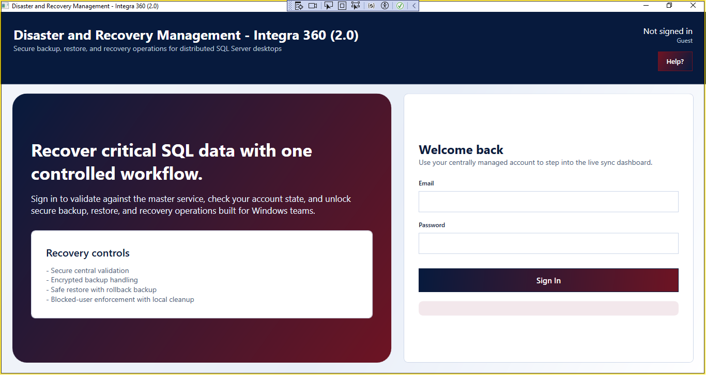 | 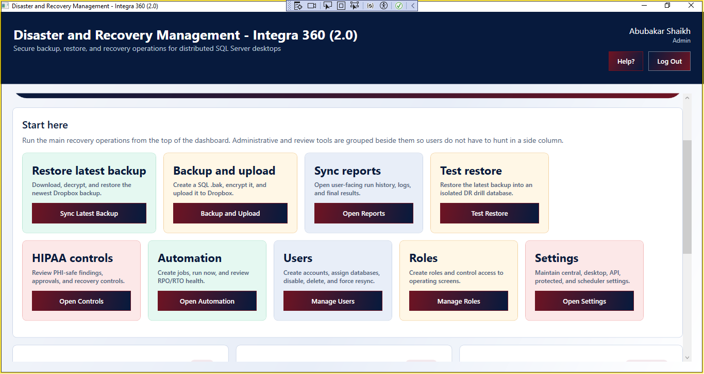 |

| Screen 3 | Screen 4 |
| --- | --- |
| 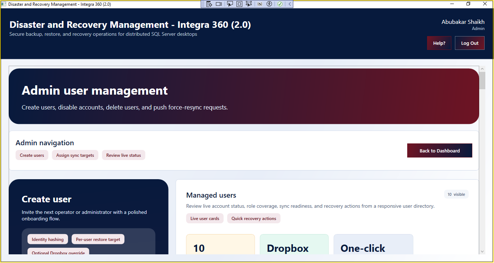 | 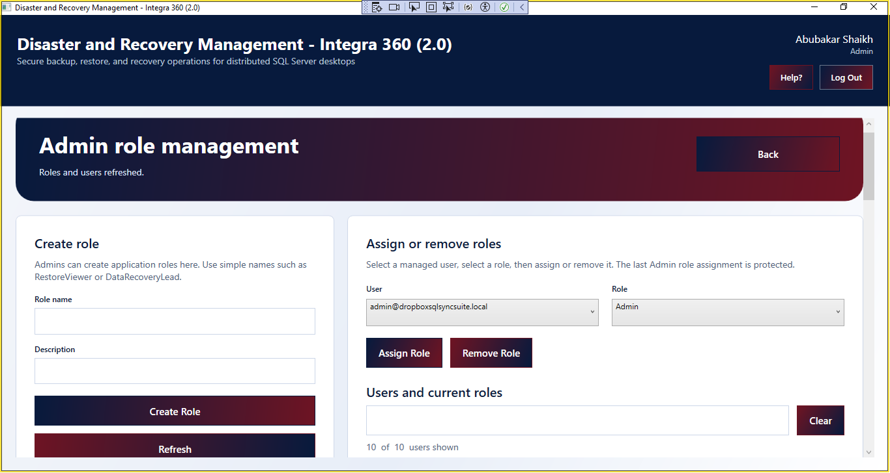 |

| Screen 5 | Screen 6 |
| --- | --- |
| 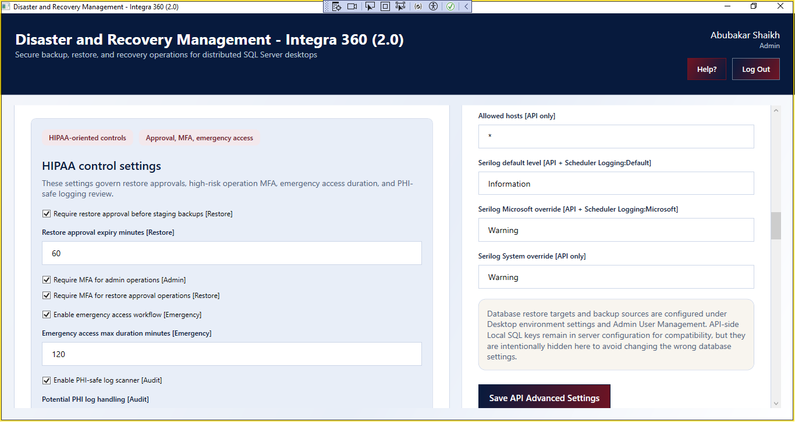 | 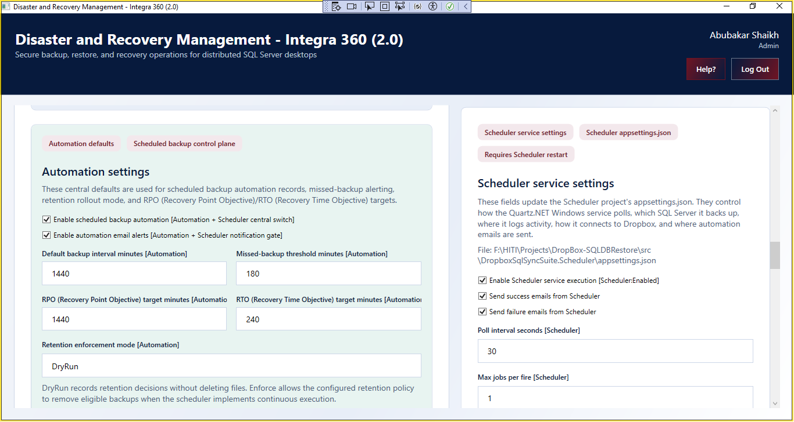 |

| Screen 7 | Screen 8 |
| --- | --- |
| 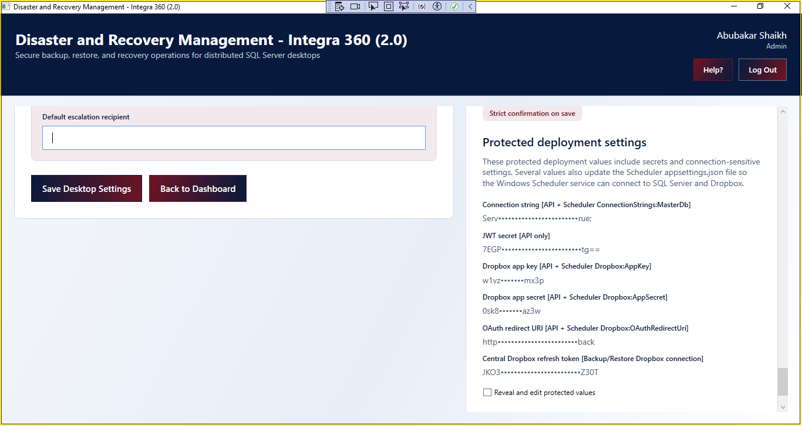 | 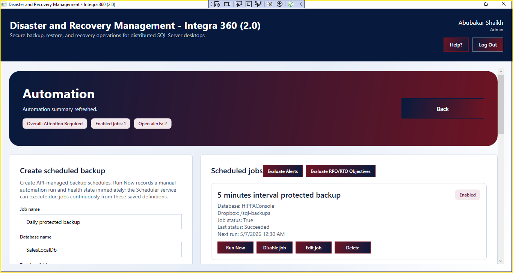 |

| Screen 9 | Screen 10 |
| --- | --- |
| 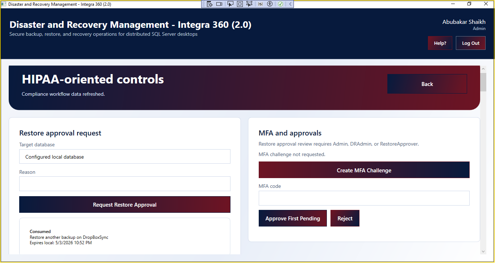 | 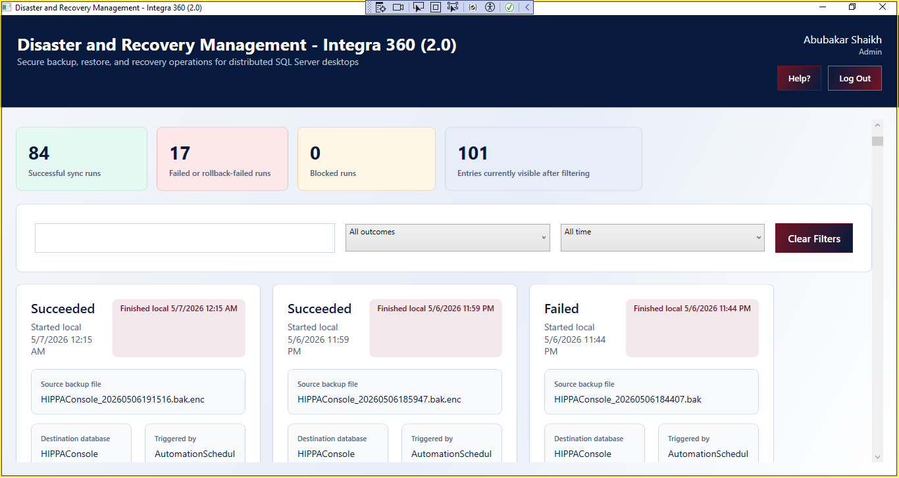 |

| Screen 11 | Screen 12 |
| --- | --- |
| 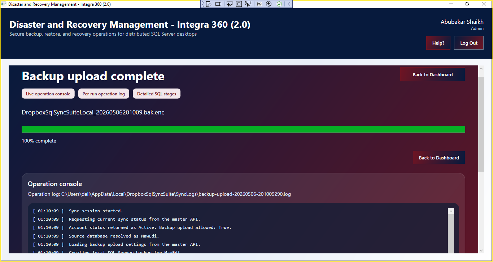 | 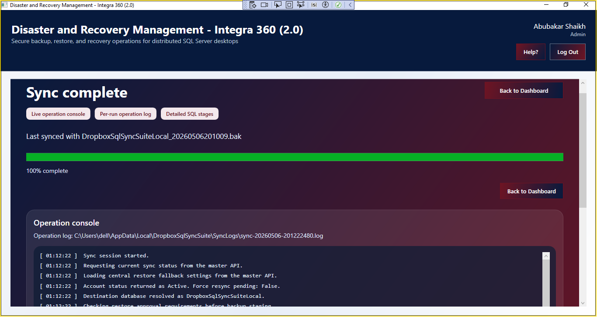 |

| Screen 13 | Screen 14 |
| --- | --- |
| 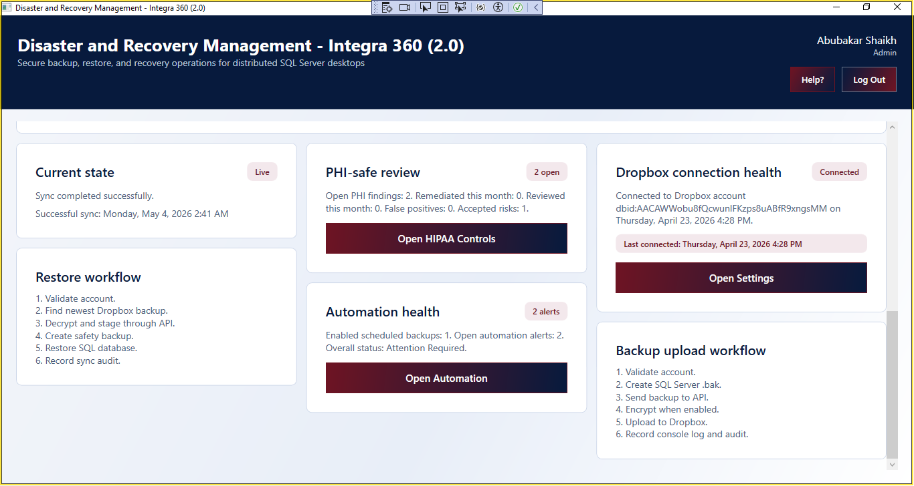 | 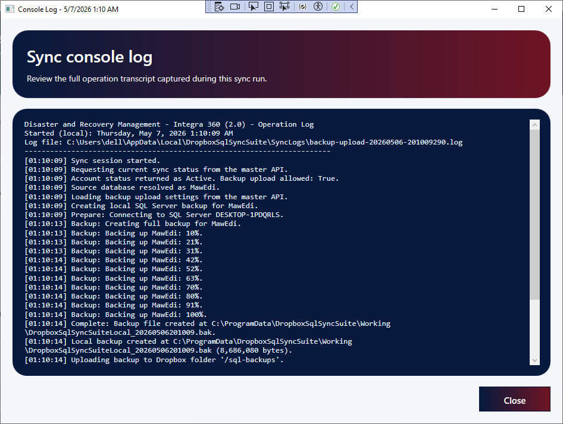 |

| Screen 15 | Screen 16 |
| --- | --- |
|  | 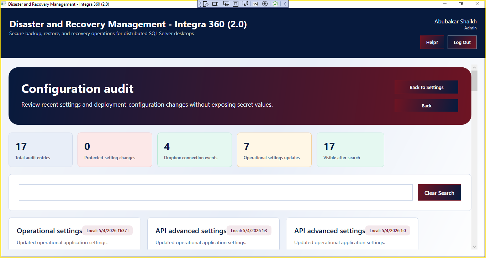 |

### Screen 17

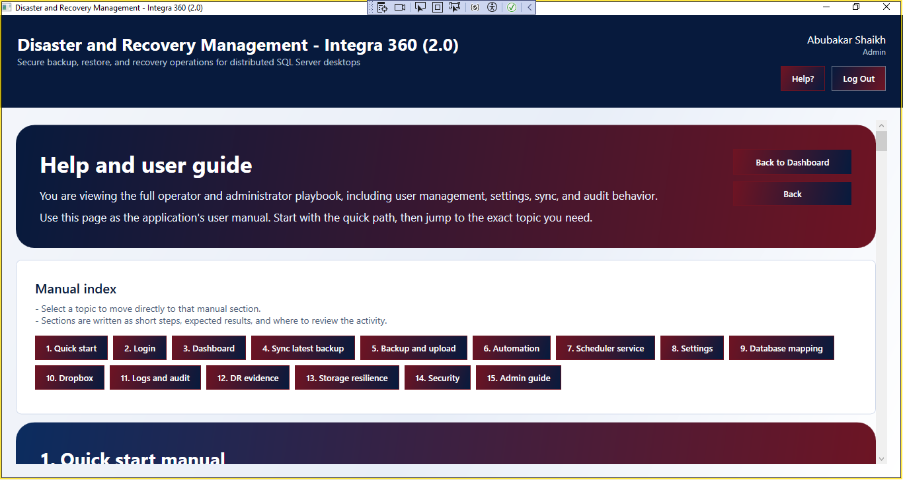

## Solution Layout

```text
DropboxSqlSyncSuite.sln
database/
  SQL deployment, seed, migration, automation, HIPAA, DR drill, and resilience scripts
docs/
  Additional implementation and deployment notes
installer/
  WiX installer project and MSI build script
screens1/
  GitHub README screenshots
src/
  DropboxSqlSyncSuite.Api
  DropboxSqlSyncSuite.Core
  DropboxSqlSyncSuite.Desktop
  DropboxSqlSyncSuite.Infrastructure
  DropboxSqlSyncSuite.Scheduler
  DropboxSqlSyncSuite.Shared
```

## Technology Stack

- .NET 9
- WPF desktop application
- ASP.NET Core Web API
- SQL Server
- Entity Framework Core
- Dropbox API
- Quartz scheduler for scheduled jobs
- Serilog logging
- WiX installer project

## Requirements

- Windows 10 or Windows 11
- .NET 9 SDK/runtime
- SQL Server or SQL Server Express/LocalDB
- Dropbox app credentials for API-based backup storage
- A configured master database for users, settings, audit history, automation, and compliance records

## Build

```powershell
dotnet restore DropboxSqlSyncSuite.sln
dotnet build DropboxSqlSyncSuite.sln
```

## Run the API

```powershell
dotnet run --project src/DropboxSqlSyncSuite.Api/DropboxSqlSyncSuite.Api.csproj
```

Configure API settings in:

```text
src/DropboxSqlSyncSuite.Api/appsettings.json
```

Important values include the master database connection string, JWT settings, Dropbox app key, Dropbox app secret, OAuth redirect URI, staging directory, encryption options, scheduler options, and compliance settings.

## Run the Desktop App

```powershell
dotnet run --project src/DropboxSqlSyncSuite.Desktop/DropboxSqlSyncSuite.Desktop.csproj
```

Configure desktop settings in:

```text
src/DropboxSqlSyncSuite.Desktop/appsettings.json
```

Important values include the API base URL, local SQL Server connection details, local database name, backup working folders, and desktop logging options.

## Database Setup

Database scripts are stored in the `database` folder. Apply the scripts in order for a clean deployment, then run the later phase scripts needed for HIPAA controls, automation, DR drill reporting, storage resilience, and retention enforcement.

For deeper deployment notes, see:

```text
docs/README.md
```

## Dropbox Connection

Dropbox is connected centrally through the API:

1. Configure Dropbox app key, app secret, and redirect URI in the API settings.
2. Register the same redirect URI in the Dropbox App Console.
3. Start the API and desktop app.
4. Sign in as an admin.
5. Open settings.
6. Click `Connect Dropbox`.
7. Complete Dropbox consent in the browser.
8. Return to the desktop app and verify the connection status.

After this setup, normal desktop users can run restore and backup workflows without storing Dropbox tokens locally.

## Scheduler Service

The scheduler project supports unattended backup automation:

```powershell
dotnet publish src/DropboxSqlSyncSuite.Scheduler/DropboxSqlSyncSuite.Scheduler.csproj -c Release
```

The scheduler reads enabled jobs, evaluates due work, creates SQL backups, sends uploads through the API/encryption pipeline, records backup run history, evaluates RPO/RTO status, and writes scheduler logs.

## Notes

- Do not commit real Dropbox keys, SQL passwords, JWT secrets, encryption keys, or production connection strings.
- Keep screenshot filenames stable if the README is published on GitHub.
- Review retention dry-run output before enabling enforce mode.
- Use demo data when testing PHI-safe log scanning and compliance exports.
